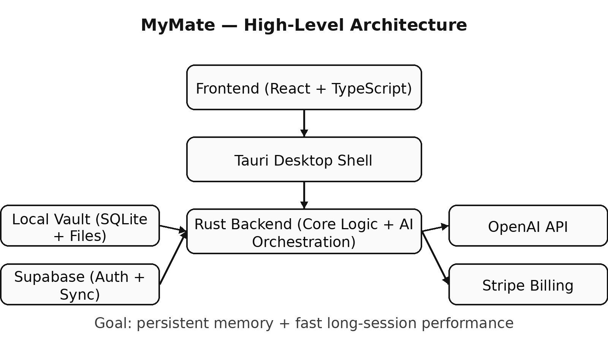

  

# MyMate Architecture Notes

Building a persistent-memory AI desktop system designed for serious daily use.

## 🚀 Why This Matters

AI tools today are session-based.

MyMate is built around persistent memory and architectural control —
designed for developers and power users who rely on AI daily.

This project explores how to build a desktop AI system that:
- Maintains long-term context
- Stays fast during long sessions
- Synchronizes across devices
- Separates orchestration from interface

This repository documents architectural decisions and technical lessons learned while building **MyMate** — a Windows AI desktop application focused on persistent memory and long-session performance.

## 🧱 Architectural Decisions

- **Why Tauri:** smaller footprint + tighter desktop control than Electron.
- **Why Rust backend:** predictable performance and safer async orchestration.
- **Why Local Vault (SQLite + files):** fast retrieval + works offline; sync is additive, not required.

---

## ⚙️ Technical Challenges Faced

- Managing long-session token growth without freezing the UI
- Designing local-first memory with optional cloud sync
- Handling async Rust orchestration without blocking Tauri
- Preventing image/file state loss across reloads

## 🧠 Problem

Most AI chat tools:
- Slow down during long sessions
- Lose context between sessions
- Require rebuilding conversations from scratch
- Do not optimize for serious, daily usage

For users who rely on AI for coding, research, and analysis, this does not scale.

---

## 🎯 Design Goals

MyMate was built with:

- Persistent session memory
- Fast local + remote sync architecture
- Desktop-first performance (Tauri + Rust backend)
- Controlled memory prefetching
- Structured chat session management
- Secure authentication (Supabase)
- Payment gating (Stripe integration)

---

## 🏗 Core Architecture

- Frontend: React + TypeScript
- Desktop shell: Tauri
- Backend logic: Rust
- Auth & Storage: Supabase
- AI provider: OpenAI
- Local vault-based memory system

The goal is continuity without performance degradation.

---

## ⚙ Lessons Learned

1. Memory is not just storage — it's retrieval strategy.
2. Sync timing across devices introduces state complexity.
3. Desktop apps require strict control of async execution.
4. UX breaks faster than backend logic.
5. Persistent AI requires architectural discipline.

---

## 📌 Current Focus

- Improving image persistence across sessions
- Refining sync conflict handling
- Optimizing long-session performance

---

